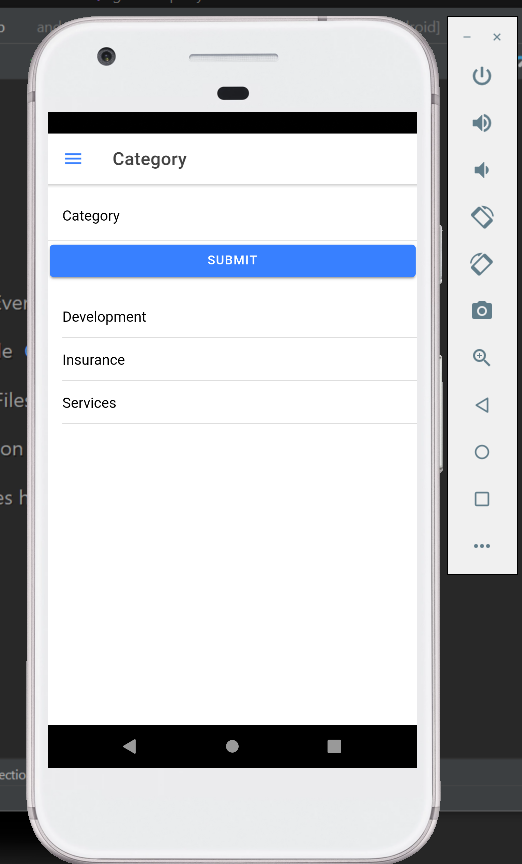
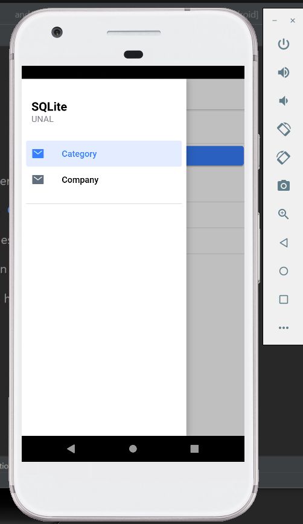
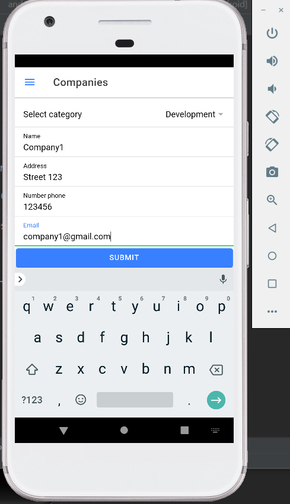
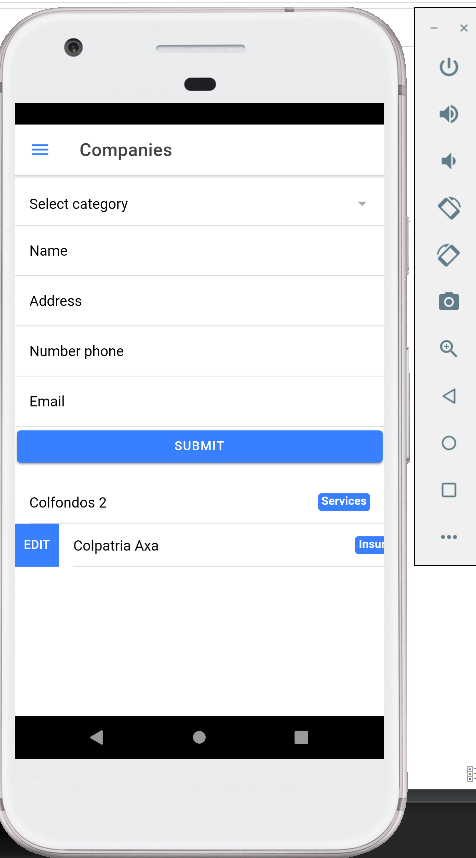
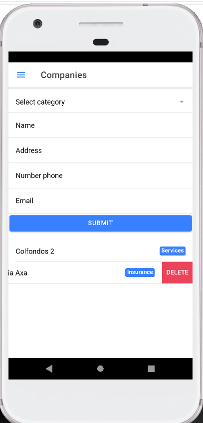

# UNAL: Desarrollo de Aplicaciones para Dispositivos Móviles
# Challenge 8: Persistencia SQLite

### Requerimientos:

- [Node.js with npm](https://nodejs.org/en/download/)
- [Ionic Framework](https://ionicframework.com/)

### Instalación y packages 

1. Clone el repositorio

2. Ingrese a la carpeta de sqlite_crud

3. Ejecute el comando `npm install` . Este instalará los paquetes requeridos 

> #### Ejecución y visualización en el navegador

1. Ingrese a la carpeta de sqlite_crud.

2. Una vez instale los paquetes requeridos, ejecute el siguiente comando `ionic build `

3. Luego el comando `npx cap sync`

4. Por último el siguiente comando para abrir el programa desde Android studio `npx cap open android`

### Evidencias 

- A continuación se encuentran algunos screenshots de la aplicación

