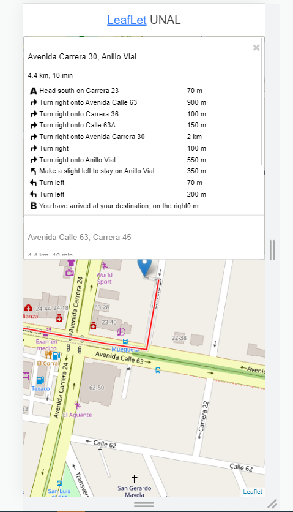
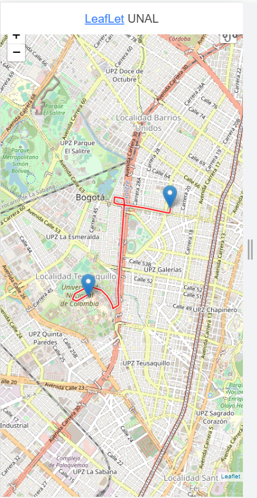

# UNAL: Desarrollo de Aplicaciones para Dispositivos Móviles
# Challenge 9: LeafLet Maps with ionic

### Requerimientos:

- [Node.js with npm](https://nodejs.org/en/download/)
- [Ionic Framework](https://ionicframework.com/)

### Instalación y packages 

1. Clone el repositorio

2. Ingrese a la carpeta de LeafLetMaps_Ionic

3. Ejecute el comando `npm install` . Este instalará los paquetes requeridos 

> #### Ejecución y visualización en el navegador

1. Ingrese a la carpeta de LeafLetMaps_Ionic.

2. Una vez instale los paquetes requeridos, ejecute el siguiente comando `ionic serve`

3. Cuando el programa compile abra la siguiente ruta en el navegador `http://localhost:8100`

### Evidencias 

- A continuación se encuentran algunos screenshots de la aplicación

